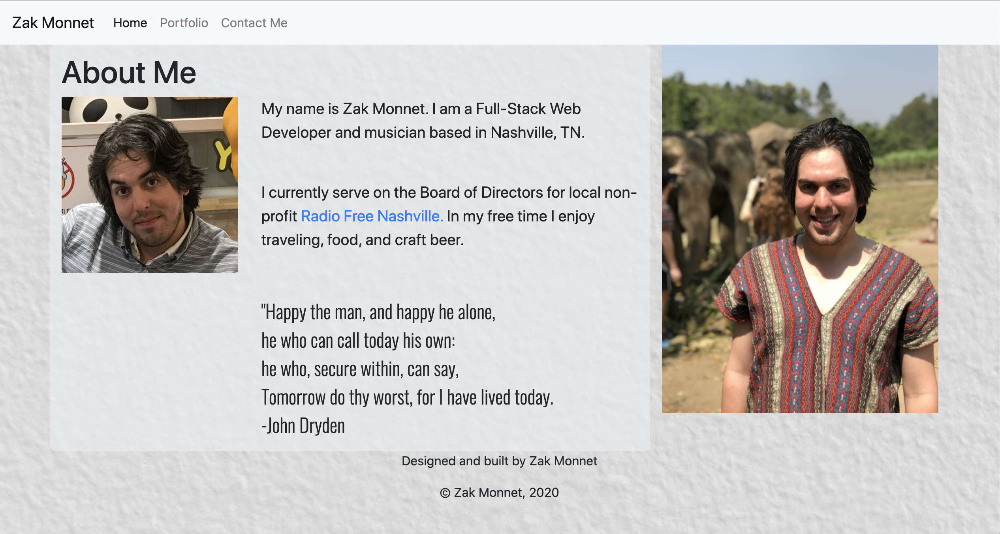

# Portfolio Website

Preview:

See it in action:
[Click Me](https://outoftune266.github.io/)

USER STORY:
- WHEN USER (a potential employer) wants to find more information about me
- THEN USER can explore my bio, completed projects, Github and LinkedIn profiles
- WHEN USER wants to contact me
- THEN USER can fill out a Google form to submit their request

Future Development Goals:
- Continue to refine styling
- Refactor code so site runs on a single HTML file
- Add functionality to directly send email rather than a form submission

Contributors:
- Zak Monnet:   [Github Profile](https://github.com/outoftune266)

Libraries Used:
- Bootstrap:   [Website](https://getbootstrap.com/)

License:
- MIT