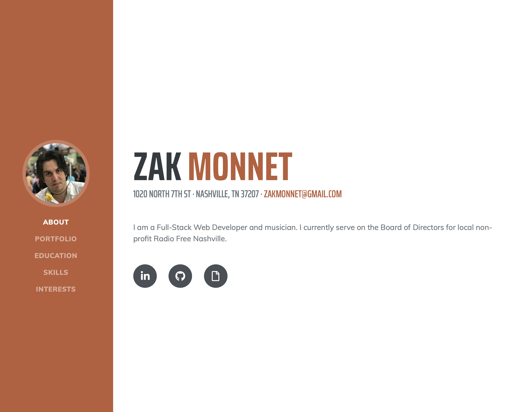

# Portfolio Website

Preview:

See it in action:
[Click Me](https://outoftune266.github.io/)

USER STORY:

- WHEN USER (a potential employer) wants to find more information about me
- THEN USER can explore my bio, completed projects, Github and LinkedIn profiles
- WHEN USER wants to contact me
- THEN USER can click my email address to open a window in their default client

Future Development Goals:

- Continue to refine styling
- Add functionality to directly send email rather than a form submission

Contributors:

- Zak Monnet: [Github Profile](https://github.com/outoftune266)

Technologies/Libraries Used:

- React
- Node.js
- Bootstrap: [Website](https://getbootstrap.com/)

License:

- MIT
